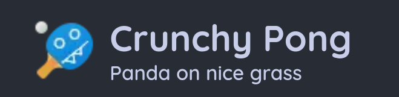
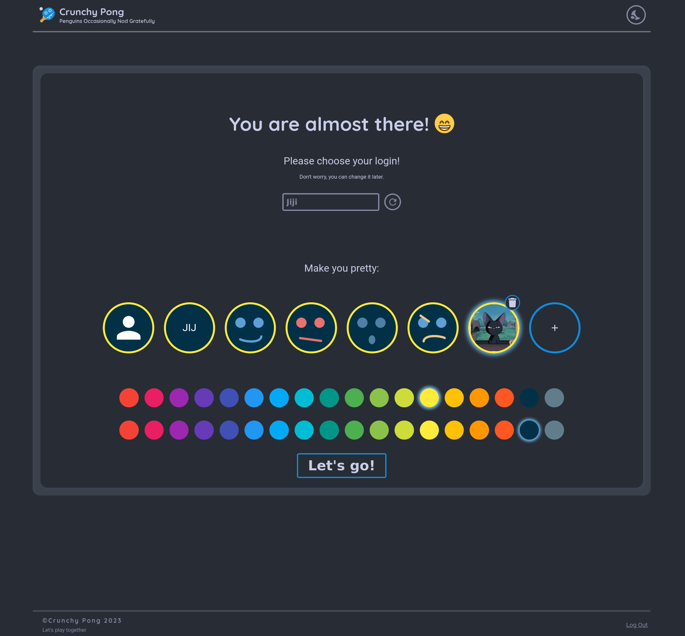
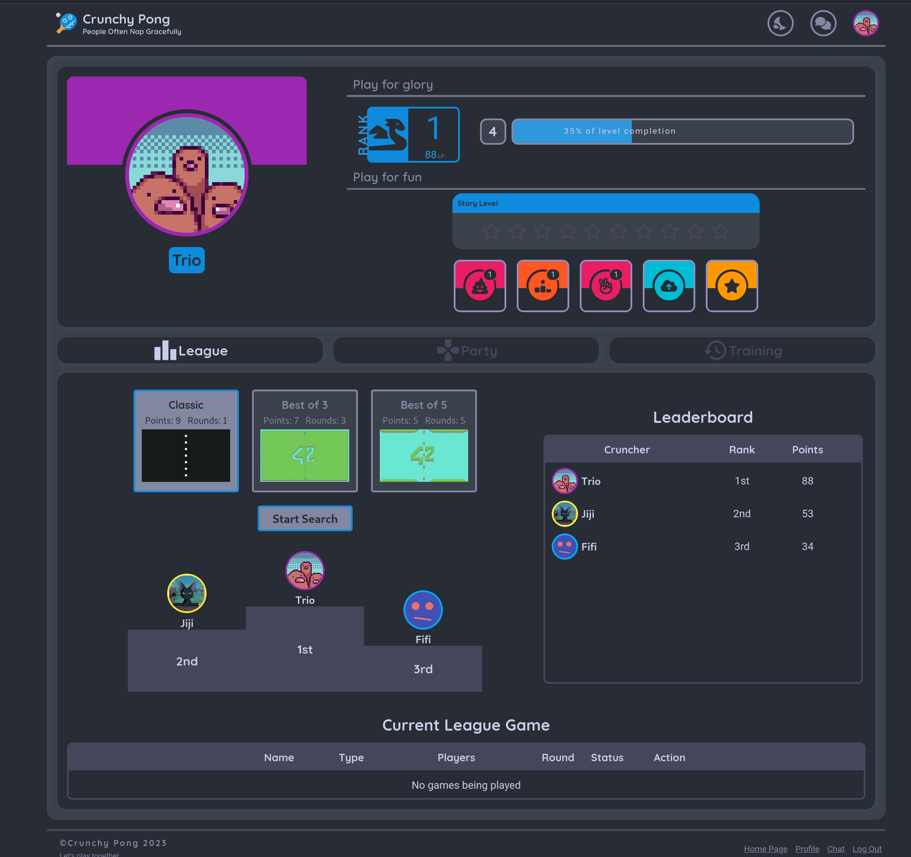
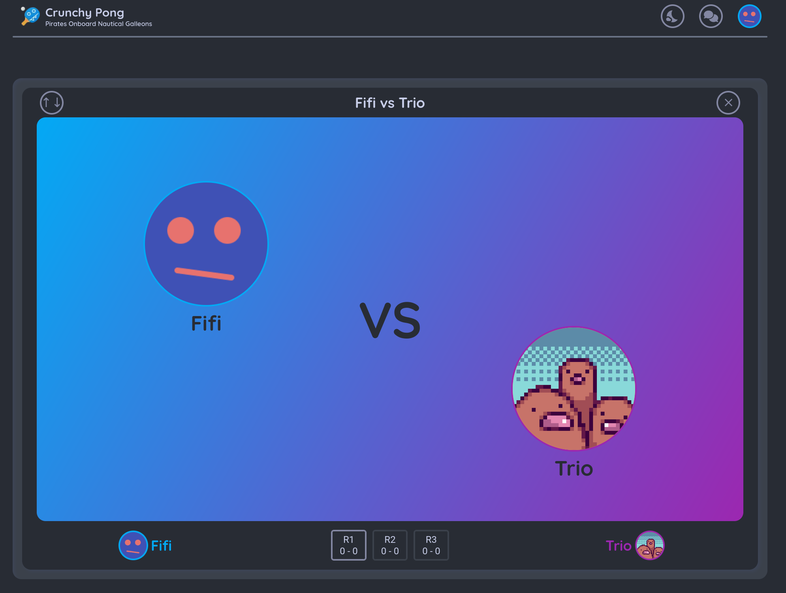
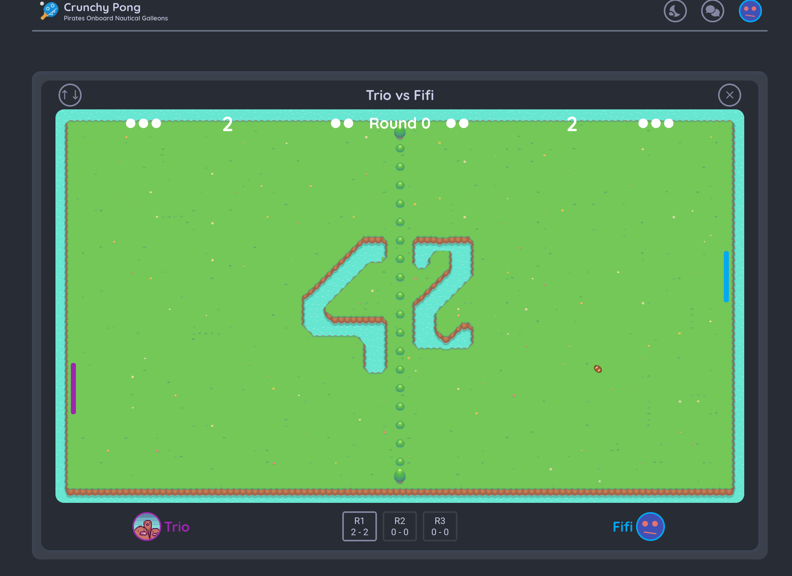
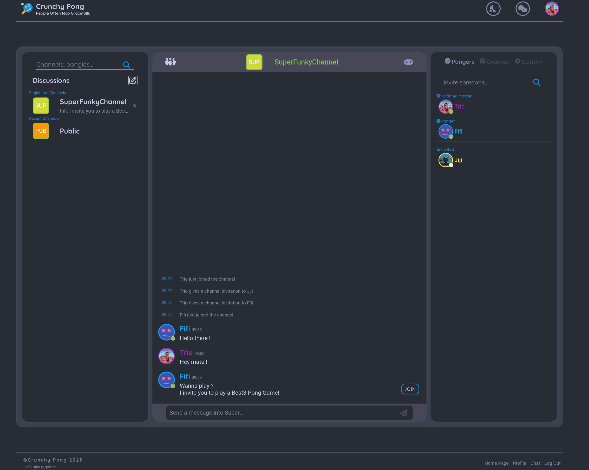
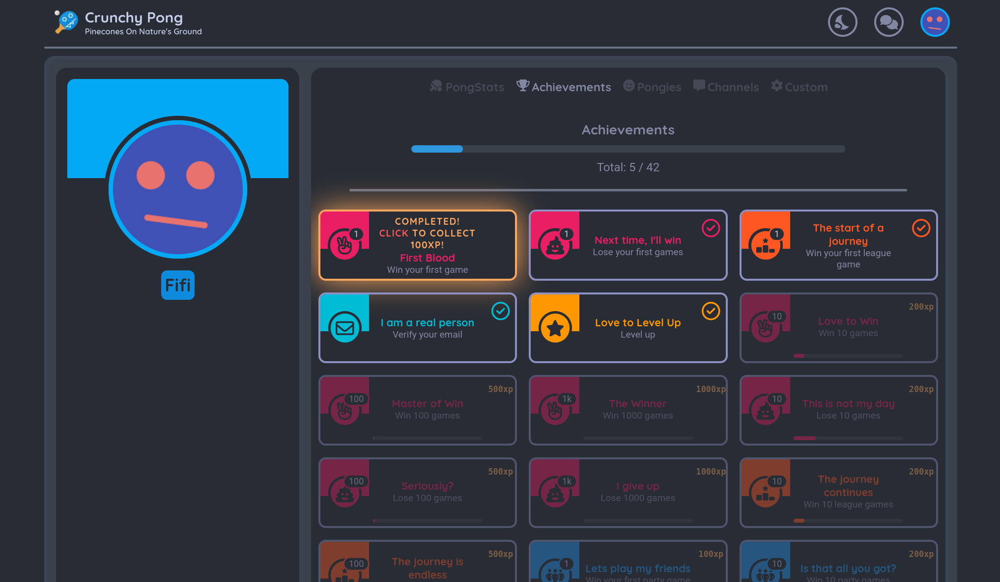
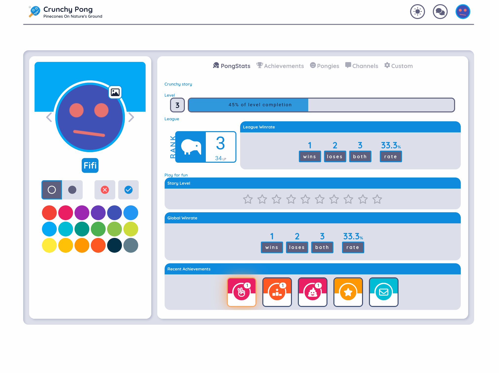
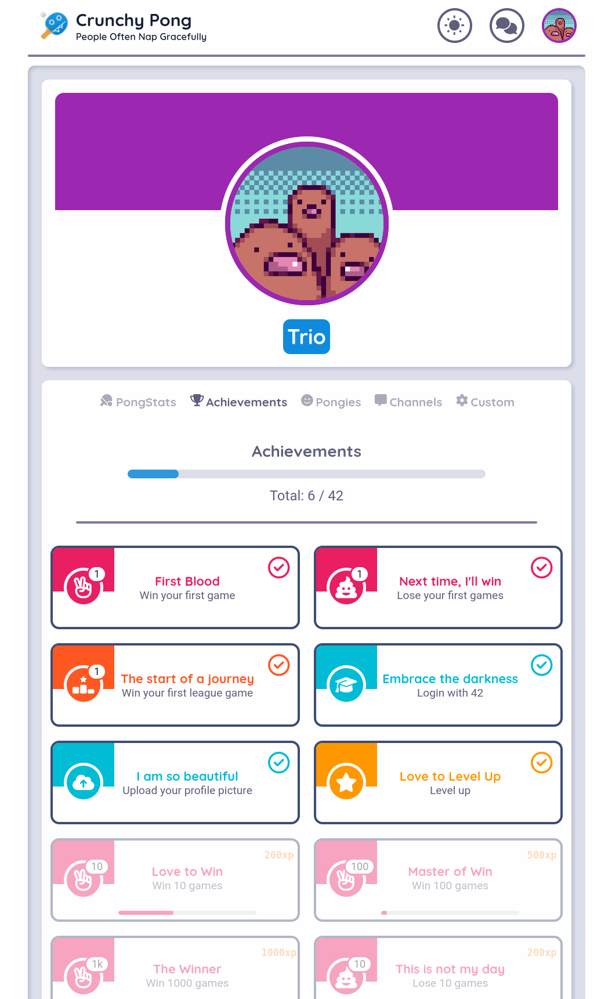

# <b>Crunchy Pong</b>

## The <b>final project</b> in 42 common core <i>ft_transcendence</i>

CrunchyPong is <b>a single-page application</b>. The main purpose of this website is to play Pong (based on the original Pong of 1972) versus other players. The website also give <b>a chat with channel hierarchy</b> to enable player to communicate with each other. It's also a social network where players can add pongies (friends), see their <b>profile</b> and their game <b>statistics and achievements</b>.

## Crunchy Pong <b>stack</b>
- **FrontEnd : React & NextJS**
- **Backend : NestJS**
- **Database : PostgreSQL**

This team project was about 5 month long. It was a nice way to learn concept like <b>authentication</b>, <b>authorization</b>, <b>websocket</b>, <b>REST API</b>, <b>entity</b> and <b>database relation</b> and a lot of stuff related to <b>TypeScript</b> and <b>NodeJS</b>. A good way to learn how <b>structure and drive a project within a team</b>. 
We improved a lot our <b>html</b> & <b>CSS</b> skills too with that <b>responsive</b> website integrating a <b>color scheme</b> switch.

## User creation

## Homepage

## Game

## Chat

## Profile

